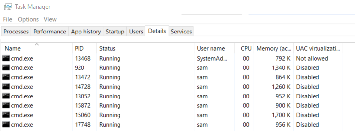
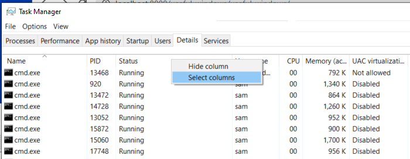
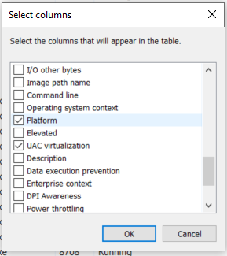
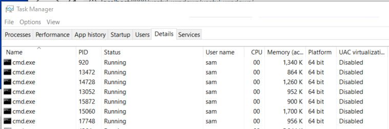

# Windows Shell / Useful Windows Examples #

This page provides examples of useful Windows use, compiled through experience developing software on Windows.

* [Determine if a Program is 32-bit or 64-bit](#determine-if-a-program-is-32-bit-or-64-bit)

--------------

## Determine if a Program is 32-bit or 64-bit ##

It is sometimes necessary to confirm that a program is 32-bit or 64-bit.
The following approaches can be used.

* **Program Files Naming Convention**
	+ If the program is installed in `C:\Program Files`, it should by convention be 64-bit,
	but this is not guaranteed, especially if the program is part of a larger software suite.
	+ Similarly, `C:\Program Files (x86)` should contain 32-bit programs.
	+ Relying on naming convention does not provide certainty.
* **System Folder Naming Convention**
	+ If the program exists in `C:\Windows\System32`, then it should by convention be 64-bit.
	**This is confusing but is what Microsoft did for backward compatibility to help transition from 32-bit to 64-bit.**
	See the [Stack Overflow article "Why do 64-bit DLLs go to System32 and 32-bit DLLS to SysWOW64 on 64-bit Windows?"](https://stackoverflow.com/questions/949959/why-do-64-bit-dlls-go-to-system32-and-32-bit-dlls-to-syswow64-on-64-bit-windows)
	for an explanation of why "32" and "64" folder names seem to be reversed.
	+ Similarly, if the program exists in `C:\Windows\SysWOW64`, then it should by convention be 32-bit.

Other options are described below.

### Use Linux `file` Command ###

If a Linux shell is available, such as Git Bash or Cygwin, the `file` command can be used.
The following example checks the `cmd.exe` program using Git Bash.
The `PE32+` plus sign indicates 64-bit.

```
$ file /C/Windows/System32/cmd.exe
/C/Windows/System32/cmd.exe: PE32+ executable (console) x86-64, for MS Windows
```

### Use Task Manager ###

If the program can be run in a way that it stays running, it can be reviewed in the ***Task Manager***.
First select the ***Details*** tab as shown below.

**<p style="text-align: center;">

</p>**

**<p style="text-align: center;">
Details Tab of Task Manager (<a href="../images/64-bit-taskmgr1.png">see full-size image</a>)
</p>**

Most likely, the ***Platform*** column is not shown as a column.
Therefore, right click on the column headings and display the following menu.
Click on ***Select columns***.

**<p style="text-align: center;">

</p>**

**<p style="text-align: center;">
Menu to Select Details Columns (<a href="../images/64-bit-taskmgr2.png">see full-size image</a>)
</p>**

Then select the ***Platform*** column, as shown below.

**<p style="text-align: center;">

</p>**

**<p style="text-align: center;">
Menu to Select Details Columns (<a href="../images/64-bit-taskmgr3.png">see full-size image</a>)
</p>**

The ***Details*** tab will then show ***Platform*** as a column and in the following example confirm
that the `cmd` program is 64-bit.  It is not clear what a blank in this column indicates.

**<p style="text-align: center;">

</p>**

**<p style="text-align: center;">
Task Manager Details Showing Platform Column (<a href="../images/64-bit-taskmgr4.png">see full-size image</a>)
</p>**
