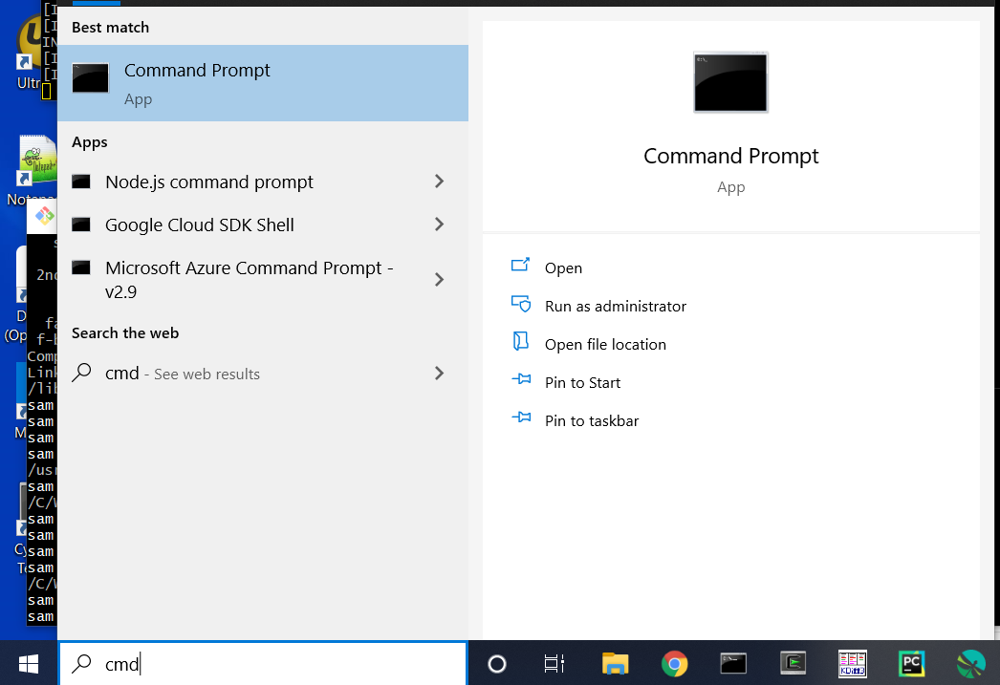

# Windows Shell / User Environment Basics #

The command shell operates between the core operating system and other programs.
Consequently, a certain amount of start-up information must be configured for the shell to do its work.
This page explains fundamental configuration and interactions for the Windows environments and `cmd` shell.

* [Location of Software Files](#location-of-software-files)
* [Location of User Files](#location-of-user-files)
* [Login Shell and Command Shell](#login-shell-and-command-shell)
* [Shell Configuration Files](#shell-configuration-files)
* [Environment Variables](#environment-variables)
* [PATH Environment Variable](#path-environment-variable)
* [File Paths](#file-paths)

-----

## Location of Software Files ##

Software files for Windows are located in standard folders.
These files provide the functionality of the Windows environment.
It may be unnecessary to deal with software files;
however, it is helpful to know where files exist in order to troubleshoot, etc.
See the [Special Folders](https://en.wikipedia.org/wiki/Special_folder)
for a summary of Windows folders accessed through environment variables.
The following table summarizes important folders for Windows command shell.

**<p style="text-align: center;">
Important Windows Shell Folders
</p>**

| **Folder**&nbsp;&nbsp;&nbsp;&nbsp;&nbsp;&nbsp;&nbsp;&nbsp;&nbsp;&nbsp;&nbsp;&nbsp;&nbsp;&nbsp;&nbsp;&nbsp;&nbsp;&nbsp;&nbsp;&nbsp;&nbsp;&nbsp;&nbsp;&nbsp;&nbsp;&nbsp;&nbsp;&nbsp;&nbsp;&nbsp;&nbsp;&nbsp;&nbsp;&nbsp;&nbsp;&nbsp;&nbsp;&nbsp;&nbsp;&nbsp; | **Environment Variable** | **Description** |
| -- | -- | -- |
| `C:\Windows\*` | Included in `PATH` in some form. | Operating system programs. |
| `C:\Windows\SysWOW64` | Included in `PATH` in some form. | Operating system programs (32-bit) - see note below. |
| `C:\Windows\System32` | Included in `PATH` in some form. | Operating system programs (64-bit) - see note below.  Location of `cmd.exe`. |
| `C:\Program Files` | May be found in `PATH`. | Additional software for 64-bit Windows.  If not in `PATH`, then typically started via ***Start*** menu. |
| `C:\Program Files (x86)` | May be found in `PATH`. | Additional software for 32-bit Windows (software that has not been updated to 64-bit).  If not in `PATH`, then typically started via ***Start*** menu. |

See the [Stack Overflow article "Why do 64-bit DLLs go to System32 and 32-bit DLLS to SysWOW64 on 64-bit Windows?"](https://stackoverflow.com/questions/949959/why-do-64-bit-dlls-go-to-system32-and-32-bit-dlls-to-syswow64-on-64-bit-windows)
for an explanation of why "32" and "64" Windows system folder names seem to be reversed.

The following shows how Linux shells map their root folder to Windows folder.

**<p style="text-align: center;">
Linux Shell Root Folder Locations
</p>**

| Environment                   | Software File Location (from shell) | Software File Location (from Windows) |
| ----------------------------- | ----------------------------------- | ------------------------------------- |
| Cygwin                        | `/`                                 | `C:\cygwin64`                         |
| Git for Windows               | `/`                                 | `C:\Program Files\Git`                |
| Linux                         | [Filesystem Hierarchy Standard on Wikipedia](https://en.wikipedia.org/wiki/Filesystem_Hierarchy_Standard) | Not applicable |
| Linux Subsystem on Windows 10 | `/`                                 | ?                                     |
| MinGW                         | ?                                   | `C:\MinGW`                            |

## Location of User Files ##

User files on Windows are located in standard folders depending on the Windows version,
for Windows 10 similar to the following:

```
C:\Windows\user
```

The home folder can be accessed programmatically using an environment variable.
See the [Environment Variables section below](#environment-variables).
The current working directory (folder) on Windows is typically shown in the command prompt and can also
be output using:

```
echo %CD%
```

For comparison, the following table summarizes user file locations for Linux environments, where `user` is the name of the user.
The Linux `pwd` command can be used to determine the present working directory,
for example after opening a command shell.

**<p style="text-align: center;">
Linux / Windows User File Mapping
</p>**

| **Environment**               | **Linux User File Location (from Linux)**&nbsp;&nbsp;&nbsp;&nbsp;&nbsp;&nbsp;&nbsp;&nbsp;&nbsp;&nbsp;&nbsp;&nbsp;&nbsp;&nbsp;&nbsp;&nbsp;&nbsp;&nbsp; | **Linux User File Location (from Windows)** | **Windows User File Location (from Linux)** | **Windows User File Location (from Windows)** |
| ----------------------------- | ------------------------------------- | --------------------------------------- | --------------------------------------- | ----------------------------------------- |
| Cygwin                        | `/home/user`                          | `C:\cygwin64\home\user`                 | `/cygdrive/C/Users/user`                | `C:\Users\user`                           |
| Git for Windows (Git Bash)    | `/c/Users/user`                       | `C:\Users\user`                         | `/c/Users/user`                         | `C:\Users\user`                           |
| Linux                         | `/home/user`                          | Not applicable                          | Not applicable                          | Not applicable                            |
| Linux Subsystem on Windows 10 | `/home/user`                          | `C:\Users\sam\AppData\Local\Packages\CanonicalGroupLimited.UbuntuonWindows_abcd123etc\LocalState\rootfs\home\sam` | `/mnt/c`, etc. | `C:\Users\user` |
| MinGW                         | ?                                     | `C:\MinGW\msys\1.0\home\user`           | ?                                       | `C:\Users\user`                           |

## Login Shell and Command Shell ##

On Linux, a command shell can be used as the login shell or to run a shell script.
On Windows, command shells are run as needed by software, and can be started by a user.
For example, sometimes a black window is temporarily shown when a computer restarts,
indicting that a batch file was run using a command shell that exited when complete.

More commonly, a Windows command shell is started from the ***Start / Windows System / Command Prompt*** menu or program launcher,
as shown below.

**<p style="text-align: center;">

</p>**

**<p style="text-align: center;">
Running a Command Shell from Search Tool (<a href="../images/search-cmd.png">see full-size image</a>)
</p>**

Once launched, the command shell displays a prompt (typically the current folder
followed by right angle bracket) and waits for interactive input:

```
C:\Users\xxx>
```

The prompt can be changed by changing the `PROMPT` environment variable,
for example by using the [`prompt`](https://docs.microsoft.com/en-us/windows-server/administration/windows-commands/prompt) command.
The title of the window can be set using the
[`title`](https://docs.microsoft.com/en-us/windows-server/administration/windows-commands/title_1) command.
Some environments provide convenience batch files, menu items, or shortcuts that start command shells pre-configured
for the software, in which case the prompt and title may be changed to reflect that environment.

## Shell Configuration Files ##

On Linux, interactive command shells are run in a terminal window and the startup settings
for a shell session can be configured with startup files such as `.bashrc` for Bash shell.

The Windows command shell behavior can be configured to some degree by setting
registry settings (see [`cmd`](https://docs.microsoft.com/en-us/windows-server/administration/windows-commands/cmd) documentation)
and by setting environment variables, as discussed in the next section.

## Environment Variables ##

The command shell program uses environment variables to hold important configuration information.
This simplifies access to important data such as the user's account name.
Windows defines standard environment variables (see
[Recognized Environment Variables](https://docs.microsoft.com/en-us/windows/deployment/usmt/usmt-recognized-environment-variables)).
For example, the `HOMEPATH` environment variable indicates the user's home folder,
typically the same as `USERPROFILE`.

A list of all environment variables can be displayed using the [`set`](https://docs.microsoft.com/en-us/windows-server/administration/windows-commands/set_1) command:

```sh
set
```

A single environment variable can be displayed with the [`echo`](https://docs.microsoft.com/en-us/windows-server/administration/windows-commands/echo)
command, using syntax similar to the following, where `%` must surround the variable name:

```sh
$ echo %HOMEPATH%
```

Environment variables are separate from normal variables in a batch file.
Normal variables are only visible in the shell script and are discarded when the shell script is complete.
The following illustrates setting a normal variable and environment variable in a shell script.
Note that an equal sign is not used with [`setx`](https://docs.microsoft.com/en-us/windows-server/administration/windows-commands/setx) command.
For example, add the following to a file such as `test.bat`:

```sh
set normalVariable=test value 1
setx ENVIRONMENT_VARIABLE "test value 2"
```

Then run the batch file from a command shell with:

```
test.bat
```

Using the `set` command will not show either value.
The normal variable was in scope only while the batch file was running.
The environmental variable was set in the "local" scope (for the user, as compared to "system" environment variables).
However, a new command shell window must be started in order to see the environment variable with `set` command.
This behavior is different from Linux, where setting an environment variable in a script does not
persist to new separate shells (only child shells).

It is customary to name environment variables with all uppercase letters, although not required.

### Scope of Environment Variables ###

Environment variables that are defined for a parent shell are inherited by child shell programs,
such as those used to run batch files.
Therefore, when a batch file is run from a command shell prompt, it is generally
not necessary to reinitialize environment variables.
However, if the batch file being run needs additional configuration prior to running,
then such configuration needs to be done in the user or system environment variables.
To set user or system environment variables,
search for "environment variable" in the Windows search tool and then edit
user or system variables.

Environment variables that are set in a script to do not propagate to other command shells that were previously started.
Setting user and system environment variables will impact every program.
Consequently, if more control is needed, it is advisable to set variables in a batch file and run when needed,
such as when starting a software development tool.

### PATH Environment Variable ###

The `PATH` environment variable indicates to shell programs how to find programs when program names
are typed at the command shell prompt or are called in batch files.
All folders in the `PATH` are searched to find the program name and the first
matching program that is found is run.
On Windows program names can be specified with or without the file extension and
files with specific extensins, including `.bat`, `.cmd`, and `.exe`,
are assumed to be executable programs.

If the `PATH` environment variable does not contain the required folder,
then the `PATH` environment variable can be modified to add the folder.
It is typical to add more specific folders at the beginning of the path so that programs
are found before system copies of the same programs.

Another option is to edit the `PATH` environment variable in a "setup" batch file that is
run from the command line.
The disadvantage to this approach is that it must be run each time a command shell window is opened.

The advantage of this approach is that configuration can be isolated from the general user environment.
To ensure that the `PATH` is not modified each time that the setup script is run,
and eventually reach the limit of the `PATH` length, a separate environment variable can be set and checked,
for example, as follows.
This only makes sense if the shell window is kept open and the same batch file is run multiple times.

```
if "%ABC_SETUP%"=="yes" (
  rem The setup has not been completed so update the PATH
  set PATH=C:\some\folder;%PATH%
  rem Set the variable to check next time
  set ABC_SETUP=yes
)
```

## File Paths ##

File paths in Windows and Linux can be absolute or relative,
where absolute paths include the full path from root folder, `/` on Linux, and `C:\` on Windows.
Relative paths are relative to the current folder and can contain `..` to move up a folder level.

File paths on Linux use the `/` separator for folder (directory) levels whereas Windows uses `\` for the separator.

Spaces in file and folder names can cause issues because programs do not know whether the
space indicates a break between command parameters.
Therefore, names containing spaces must be surrounded by double.
Some environments, such as Cygwin, allow spaces to be handled by inserting a backslash before the space.

Modifying the `PATH` can simplify handling software installation folders that contain spaces because
the spaces don't need to be dealt with every time that a program name is typed.
